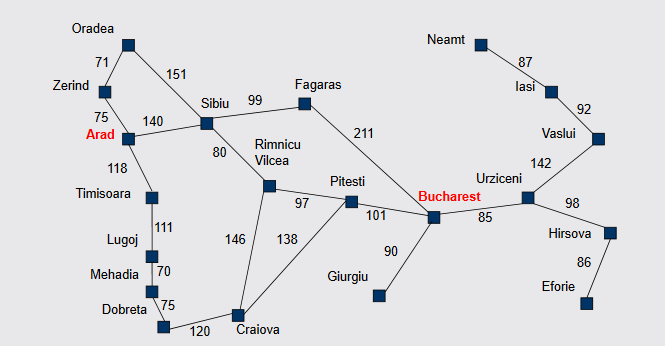
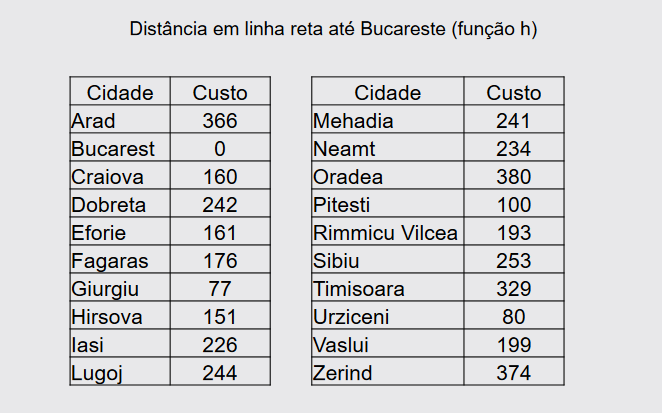

# Algoritmo-A-estrela
reciar os algoritmo a estrela em python

<h1 align="center">Algoritmo AEstrela (A*)</h1>

<h2 align="center">Reconstruir algoritmo AEstrela para busca de caminho com base no problema proposto.</h2>

 

<h1 align="center">PROBLEMA</h1>
<h2 align="center">Para o mapa apresentado construa a árvore de busca do caminho entre as cidades Arad e Bucharestpara as estratégias de busca em Largura e em Profundidade.</h2>

  

 

<h1 align="center">DISTÂNCIA EM LINHA RETA ATÉ BUCARESTE (função h) </h1>

  

 

<h1 align="center">CLASSES E FUNÇÕES</h1>

ATRIBUTOS PARA CLASSE NÓ:
–String nome; (get - construtor)
–double valorFuncaoF= 0; (get e set)
–doublevalorFuncaoG; (get e set)
–doublevalorFuncaoH; (get - construtor)
–Nó antecessor; (get e set)
–Aresta[] adjacentes; (get e set)
 
ATRIBUTOS PARA CLASSE ARESTA:
–Double custo; (get - construtor)
–No alvo; (get - construtor)
 
FUNÇÃO AESTRELA:
–Public static void main(String[] args){}
–publicstaticvoidbuscaAEstrela(Nó origem, Nó destino) {}